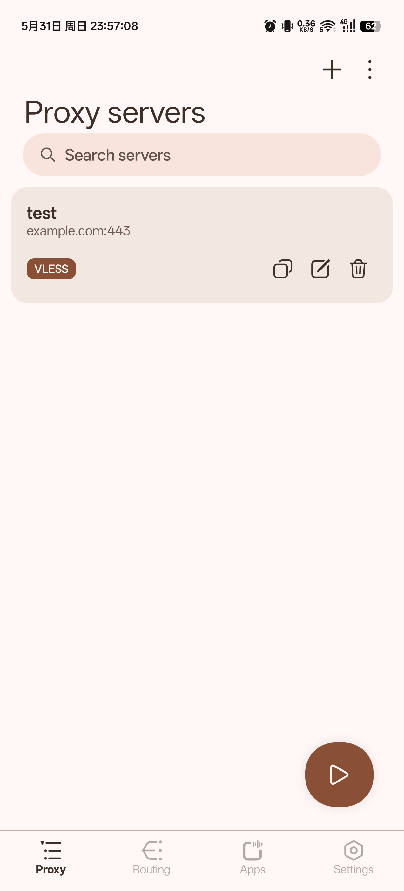
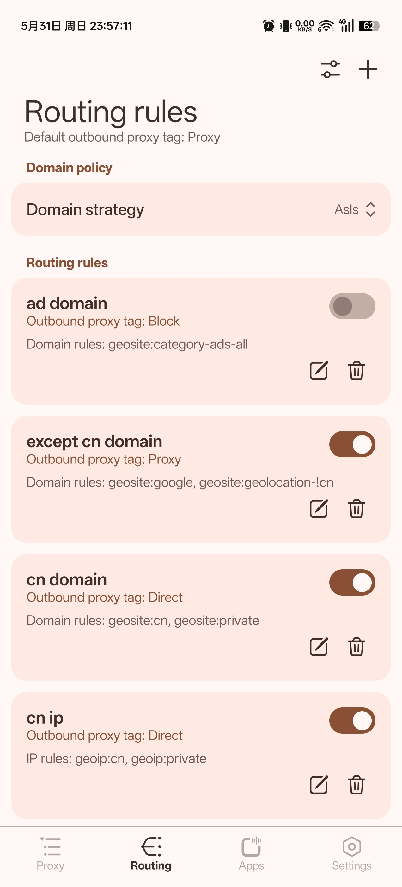
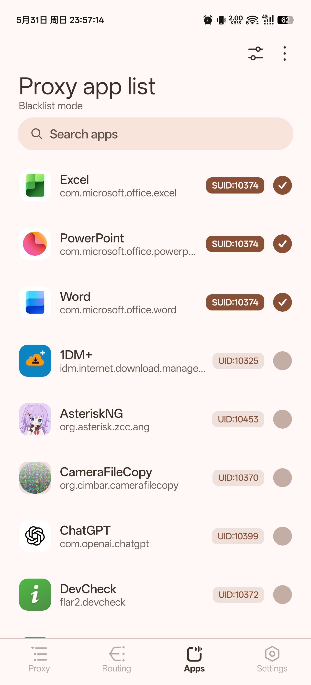
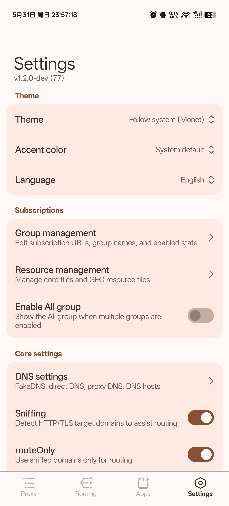

English | [简体中文](README_zh_CN.md)

# AsteriskNG

An Xray client for Android, powered by [Xray-core](https://github.com/XTLS/Xray-core), [AndroidLibXrayLite](https://github.com/2dust/AndroidLibXrayLite), and [hev-socks5-tunnel](https://github.com/heiher/hev-socks5-tunnel).

## Telegram Channel

[Asterisk4Magisk](https://t.me/Asterisk4Magisk)

## Features

- VPN Service, TPROXY(ROOT), and TUN2SOCKS(ROOT) run modes support
- VMess, VLESS, Trojan, Shadowsocks, Socks, HTTP, Hysteria2, WireGuard, strategy group, and chain proxy support
- v2rayNG, mihomo subscription format support
- Resource file management for `geoip.dat`, `geosite.dat`, `geoip-only-cn-private.dat`, and the Xray executable
- ROOT start-on-boot script generation through Magisk `service.d`
- MIUIX Compose UI

## Screenshots

<p align="center">
  
  
  
  
</p>

## Run Modes

### VPN Service

- Works without root permission.
- Uses Android `VpnService`.
- Suitable for normal Android app-level VPN usage.

### TPROXY(ROOT)

- Requires root permission.
- Runs the local Xray executable directly with libsu.
- Uses iptables and policy routing for transparent proxy traffic.
- Uses the configured transparent proxy port as the Xray inbound.

### TUN2SOCKS(ROOT)

- Requires root permission.
- Runs the local Xray executable directly with libsu.
- Uses `hev-socks5-tunnel` to create the fixed TUN device `asterisk0`.
- Uses Xray's local SOCKS5 inbound as the tunnel target.
- Shares most ROOT routing and app proxy behavior with TPROXY, but routes traffic through the TUN device instead of Xray's TPROXY inbound.

## Resource Files

- Runtime files are stored in the app private `files/xray` directory, commonly `/data/user/0/org.asterisk.zcc.ang/files/xray`.
- The bundled Xray executable is restored from native libraries and can be replaced manually with an `xray` executable file or a zip archive containing `xray`.
- `geoip.dat` and `geosite.dat` can be restored from bundled assets, updated from online sources, or replaced manually.
- Built-in update sources include [Loyalsoldier/v2ray-rules-dat](https://github.com/Loyalsoldier/v2ray-rules-dat), [v2fly/geoip](https://github.com/v2fly/geoip), [v2fly/domain-list-community](https://github.com/v2fly/domain-list-community), [Chocolate4U/Iran-v2ray-rules](https://github.com/Chocolate4U/Iran-v2ray-rules), and [runetfreedom/russia-v2ray-rules-dat](https://github.com/runetfreedom/russia-v2ray-rules-dat).

## Development

Open the project root in Android Studio, or build it with Gradle wrapper:

```powershell
.\gradlew.bat assembleDebug
```

On macOS or Linux:

```bash
./gradlew assembleDebug
```

The build:

- uses the Android SDK and NDK
- downloads or prepares the bundled Xray-core asset
- builds the native `setuidgid` helper
- packages native runtime components for `arm64-v8a`, `armeabi-v7a`, `x86`, and `x86_64`

If Gradle cannot find Android NDK, set `ndk.dir` in `local.properties`, set `ANDROID_NDK_HOME`, or install an NDK under the Android SDK.

## WSA

For WSA, VPN permission can be granted with:

```bash
appops set org.asterisk.zcc.ang ACTIVATE_VPN allow
```

## License

[GPL-3.0](LICENSE)

## Credits

- [@XTLS/Xray-core](https://github.com/XTLS/Xray-core)
- [@2dust/AndroidLibXrayLite](https://github.com/2dust/AndroidLibXrayLite)
- [@heiher/hev-socks5-tunnel](https://github.com/heiher/hev-socks5-tunnel)
- [@topjohnwu/libsu](https://github.com/topjohnwu/libsu)
- [@compose-miuix-ui/miuix](https://github.com/compose-miuix-ui/miuix)
- [@2dust/v2rayNG](https://github.com/2dust/v2rayNG)
- [@Loyalsoldier/v2ray-rules-dat](https://github.com/Loyalsoldier/v2ray-rules-dat)
- [@v2fly/geoip](https://github.com/v2fly/geoip)
- [@v2fly/domain-list-community](https://github.com/v2fly/domain-list-community)
- [@Chocolate4U/Iran-v2ray-rules](https://github.com/Chocolate4U/Iran-v2ray-rules)
- [@runetfreedom/russia-v2ray-rules-dat](https://github.com/runetfreedom/russia-v2ray-rules-dat)
