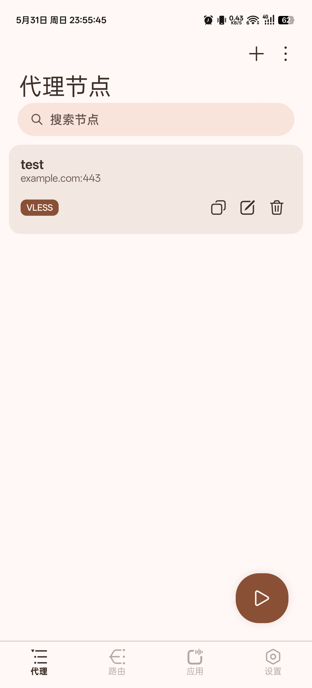
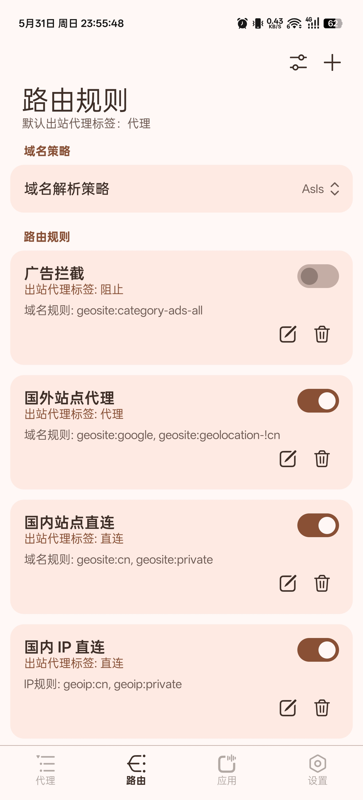
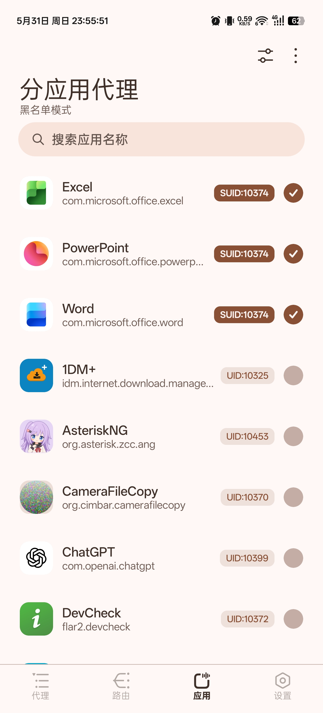
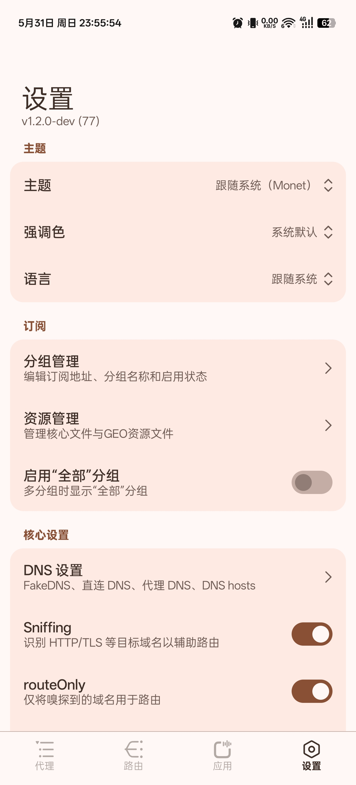

[Русский](README_ru.md) | [English](README.md) | 简体中文

# AsteriskNG

一个 Android Xray GUI 客户端，使用 [Xray-core](https://github.com/XTLS/Xray-core)、[AndroidLibXrayLite](https://github.com/2dust/AndroidLibXrayLite)、[hev-socks5-tunnel](https://github.com/heiher/hev-socks5-tunnel) 实现。

## Telegram Channel

[Asterisk4Magisk](https://t.me/Asterisk4Magisk)

## 功能

- VPN Service、TPROXY(ROOT)、TUN2SOCKS(ROOT) 和 BPF2SOCKS(ROOT) 运行模式
- VMess、VLESS、Trojan、Shadowsocks、Socks、HTTP、Hysteria2、WireGuard、策略组和链式代理支持
- v2rayNG、mihomo 订阅格式支持
- 管理 `geoip.dat`、`geosite.dat`、`geoip-only-cn-private.dat` 和 Xray 可执行文件等资源文件
- 通过 Magisk `service.d` 脚本支持 ROOT 模式开机自启
- 通过 native ROOT 网络守护进程维护动态本机地址 bypass、系统 IPv6 与 IPv6 热点代理
- MIUIX Compose UI

## 预览

<p align="center">
  
  
  
  
</p>

## 运行模式

### VPN Service

- 无需 root 权限。
- 使用 Android `VpnService`。
- 适合常规 Android 应用级 VPN 使用场景。

### TPROXY(ROOT)

- 需要 root 权限。
- 通过 libsu 直接运行本地 Xray 可执行文件。
- 使用 iptables 和策略路由处理透明代理流量。
- 使用已配置的透明代理端口作为 Xray 入站。

### TUN2SOCKS(ROOT)

- 需要 root 权限。
- 通过 libsu 直接运行本地 Xray 可执行文件。
- 使用 `hev-socks5-tunnel` 创建固定 TUN 设备 `asterisk0`。
- 使用 Xray 的本地 SOCKS5 入站作为隧道目标。
- 与 TPROXY 共享大部分 ROOT 路由和应用代理行为，但流量会通过 TUN 设备转发，而不是通过 Xray 的 TPROXY 入站。

### BPF2SOCKS(ROOT)

- 需要 root 权限，并要求 Android 内核支持 eBPF。
- 通过 libsu 直接运行本地 Xray 可执行文件和 native `bpf2socks` helper。
- 使用 cgroup eBPF 程序将本机 TCP 连接和 UDP 数据报重定向到 BPF2SOCKS bridge，再由 bridge 转发到 Xray 的本地 SOCKS5 入站。
- 不创建 TUN 设备。默认 bridge 端口为 `65532`，默认 SOCKS5 入站端口为 `65534`。
- 启动前要求 eBPF probe 通过。设备支持不足时，该模式无法启动。

### ROOT 地址监控

- 所有 ROOT 模式会在 Xray 与模式规则就绪后启动 native `asteriskd` 监控器。
- 它会监听本地 IPv4/IPv6 地址变化，并原子更新直连绕过的 iptables 链或 BPF map，避免公网地址被错误送入代理路径。
- 启用禁用系统 IPv6 时，它会对新出现的 IPv6 接口继续生效；启用 IPv6 时，它会响应已配置的热点接口，并按需移除 Android IPv6 TC offload 规则。
- 日志路径为 `files/xray/logs/asteriskd.log`；生成的 `files/xray/stop.sh` 是唯一的 ROOT 停止入口，会先恢复已记录的 IPv6 状态再清理规则。

## 资源文件

- 运行时文件存储在应用私有的 `files/xray` 目录中，通常为 `/data/user/0/org.asterisk.zcc.ang/files/xray`。
- 内置 Xray 可执行文件会从 native libraries 还原，也可以手动替换为 `xray` 可执行文件，或替换为包含 `xray` 的 zip 压缩包。
- `geoip.dat` 和 `geosite.dat` 可以从内置 assets 还原、从在线来源更新，或手动替换。
- 内置更新来源包括 [Loyalsoldier/v2ray-rules-dat](https://github.com/Loyalsoldier/v2ray-rules-dat)、[v2fly/geoip](https://github.com/v2fly/geoip)、[v2fly/domain-list-community](https://github.com/v2fly/domain-list-community)、[Chocolate4U/Iran-v2ray-rules](https://github.com/Chocolate4U/Iran-v2ray-rules) 和 [runetfreedom/russia-v2ray-rules-dat](https://github.com/runetfreedom/russia-v2ray-rules-dat)。

## 开发

构建前初始化 submodule：

```bash
git submodule update --init --recursive
```

使用 Android Studio 打开项目根目录，或通过 Gradle wrapper 构建：

```powershell
.\gradlew.bat assembleDebug
```

macOS 或 Linux：

```bash
./gradlew assembleDebug
```

构建过程会：

- 使用 Android SDK 和 NDK
- 下载或准备内置 Xray-core 资源
- 构建前将 `hev-socks5-tunnel` checkout 到 `ProjectConfig.HEV_SOCKS5_TUNNEL_VERSION`
- 从 submodule 构建 native `hev-socks5-tunnel` JNI library 和 CLI runtime
- 将 `asteriskd`、`bpf2socks`、`bpfmatcher` 和 `setuidgid` checkout 到各自的 `ProjectConfig` 版本，再使用 NDK 构建
- 为 `arm64-v8a`、`armeabi-v7a`、`x86` 和 `x86_64` 打包 native 运行时组件

如果 Gradle 找不到 Android NDK，请在 `local.properties` 中设置 `ndk.dir`，设置 `ANDROID_NDK_HOME`，或在 Android SDK 下安装 NDK。

## WSA

对于 WSA，可以使用以下命令授予 VPN 权限：

```bash
appops set org.asterisk.zcc.ang ACTIVATE_VPN allow
```

## 许可

[GPL-3.0](LICENSE)

## 致谢

- [@XTLS/Xray-core](https://github.com/XTLS/Xray-core)
- [@2dust/AndroidLibXrayLite](https://github.com/2dust/AndroidLibXrayLite)
- [@heiher/hev-socks5-tunnel](https://github.com/heiher/hev-socks5-tunnel)
- [@topjohnwu/libsu](https://github.com/topjohnwu/libsu)
- [@compose-miuix-ui/miuix](https://github.com/compose-miuix-ui/miuix)
- [@2dust/v2rayNG](https://github.com/2dust/v2rayNG)
- [@Loyalsoldier/v2ray-rules-dat](https://github.com/Loyalsoldier/v2ray-rules-dat)
- [@v2fly/geoip](https://github.com/v2fly/geoip)
- [@v2fly/domain-list-community](https://github.com/v2fly/domain-list-community)
- [@Chocolate4U/Iran-v2ray-rules](https://github.com/Chocolate4U/Iran-v2ray-rules)
- [@runetfreedom/russia-v2ray-rules-dat](https://github.com/runetfreedom/russia-v2ray-rules-dat)
- [@mayaxcn/china-ip-list](https://github.com/mayaxcn/china-ip-list)
